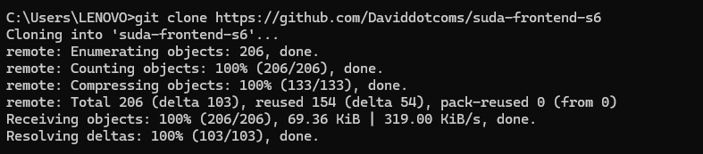
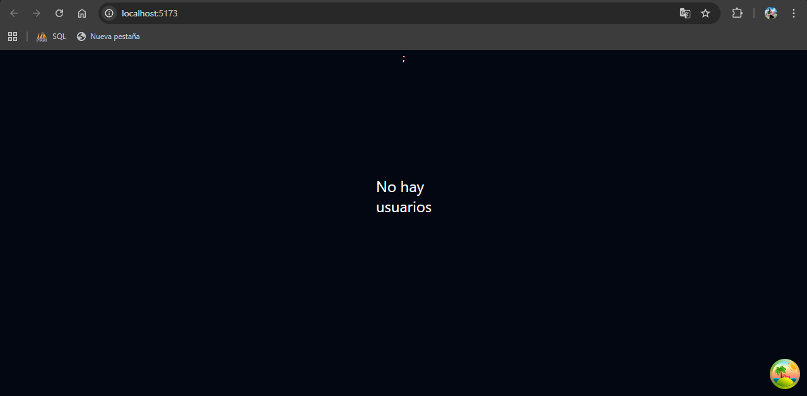
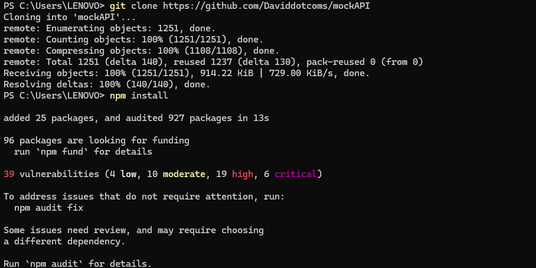

# Práctica Crear imagen personalizada

## 1. Título

**Creación de Imagen Docker Personalizada para Aplicación React con Backend Simulado**

---

## 2. Tiempo de duración

**Tiempo estimado:** 60 minutos

---

## 3. Fundamentos

La contenerización con Docker permite empaquetar aplicaciones junto con todas sus dependencias en entornos aislados y portables llamados contenedores. Esto garantiza que el software se ejecute de manera consistente sin importar el sistema operativo o la configuración del equipo donde se despliegue. En este proyecto, se aplican estos principios para encapsular una aplicación frontend desarrollada en React, utilizando un Dockerfile que define el proceso de construcción y despliegue dentro de un contenedor basado en Nginx. Adicionalmente, se ejecuta un servicio backend simulado que permite suministrar datos a la aplicación, demostrando cómo Docker facilita la interoperabilidad entre servicios y simplifica el proceso de desarrollo, pruebas y despliegue de aplicaciones web modernas.

## 4. Conocimientos previos

Para la realización de este trabajo es necesario contar con conocimientos básicos en el uso de Git para clonar repositorios y gestionar proyectos, así como familiaridad con Node.js y npm, herramientas esenciales para instalar dependencias y ejecutar aplicaciones desarrolladas en React. También se requiere comprender el funcionamiento básico de Docker, incluyendo conceptos como imágenes, contenedores y Dockerfile, para poder construir y ejecutar la aplicación dentro de un entorno aislado. Adicionalmente, es útil conocer la estructura de proyectos en React, el proceso de construcción (npm run build) y el uso de servidores como Nginx para desplegar aplicaciones estáticas. Por último, se deben entender las bases del consumo de APIs, ya que el frontend depende de un backend simulado para obtener datos durante su ejecución.

## 5. Objetivos a alcanzar

- Clonar correctamente el repositorio del proyecto frontend desarrollado en React.
- Ejecutar la aplicación de manera local para verificar su correcto funcionamiento antes de contenerizarla.
- Configurar y ejecutar el servicio backend simulado necesario para el consumo de datos por parte del frontend.
- Diseñar y crear un archivo Dockerfile adecuado para construir una imagen optimizada de la aplicación.
- Generar una imagen Docker funcional a partir del Dockerfile y validar su correcto funcionamiento.
- Crear y ejecutar un contenedor basado en dicha imagen, garantizando que la aplicación sea accesible desde el navegador.
- Asegurar la comunicación entre la aplicación frontend y el backend simulado durante la ejecución en contenedores.
- Documentar todo el proceso para facilitar su comprensión, replicación y futura implementación.


## 6. Equipo necesario

- Computadora personal con sistema operativo Windows, Linux o macOS capaz de ejecutar entornos de desarrollo modernos.
- Conexión a Internet para clonar los repositorios del frontend y del backend simulado.
- Docker Desktop o Docker Engine, necesario para crear, gestionar y ejecutar imágenes y contenedores.
- Node.js y npm instalados para ejecutar la aplicación React y el servicio mockAPI en entorno local.
- Git para clonar y gestionar los repositorios del proyecto.

---

## 7. Material de apoyo

- Repositorio oficial del frontend:
Código fuente de la aplicación React utilizada para la construcción de la imagen Docker.
- Guía de referencia para la creación de Dockerfile, construcción de imágenes y ejecución de contenedores.
- Servicio JSON Server que provee los datos necesarios para el funcionamiento del frontend.
- Información técnica sobre el funcionamiento del entorno de desarrollo, scripts disponibles y estructura del proyecto.
- Referencias para la clonación y manejo de repositorios mediante línea de comandos.

---

## 8. Procedimiento

### Paso 1: Clonar los repositorios del proyecto

Desde una terminal, ejecutar los siguientes comandos para obtener tanto el frontend como el backend simulado:

```bash
git clone https://github.com/Daviddotcoms/suda-frontend-s6
git clone https://github.com/Daviddotcoms/mockAPI
```

Con estas instrucciones se obtendrán ambos repositorios en carpetas independientes dentro del directorio donde se ejecutaron los comandos.



**Figura 8-1. Clonación exitosa de los repositorios frontend y backend.**

---

### Paso 2: Instalar dependencias y ejecutar el frontend localmente

Entrar en la carpeta del proyecto frontend e instalar sus dependencias:

```bash
cd suda-frontend-s6
npm install
```

Una vez finalizada la instalación, iniciar la aplicación en modo desarrollo:

```bash
npm run dev
```

Por defecto, la aplicación React se habilitará en http://localhost:5173
 o en el puerto indicado por la terminal.



**Figura 8-2. Aplicación React ejecutándose correctamente en modo desarrollo.**

---

### Paso 3: Ejecutar el backend simulado (Mock API)

Abrir otra terminal (sin cerrar la que ejecuta el frontend), desplazarse al directorio del backend e instalar lo necesario:

```bash
cd mockAPI
npm install
```

Luego, comenzar la ejecución del servidor de datos:

```bash
npm run dev
```

Este servicio Mock API se habilitará usualmente en http://localhost:3001
, proporcionando los endpoints que requiere el frontend.



**Figura 8-3. Mock API activa y respondiendo en el puerto 3001.**

---

### Paso 4: Crear el archivo Dockerfile

En el directorio principal del proyecto frontend (suda-frontend-s6), generar un archivo denominado Dockerfile con este contenido:

```dockerfile
# Etapa 1: Construcción de la aplicación React
FROM node:18 AS build

# Establecer el directorio de trabajo
WORKDIR /app

# Copiar archivos de dependencias
COPY package*.json ./

# Instalar dependencias
RUN npm install

# Copiar el resto del código fuente
COPY . .

# Construir la aplicación para producción
RUN npm run build

# Etapa 2: Servir la aplicación con Nginx
FROM nginx:alpine

# Copiar los archivos construidos desde la etapa anterior
COPY --from=build /app/dist /usr/share/nginx/html

# Exponer el puerto 80
EXPOSE 80

# Comando para iniciar Nginx
CMD ["nginx", "-g", "daemon off;"]
```

Este Dockerfile usa una construcción en dos fases: primero genera los archivos finales con Node.js y luego los despliega dentro de una imagen ligera basada en Nginx.


### Paso 5: Construir la imagen Docker

Situado dentro del proyecto frontend, ejecutar:

```bash
docker build -t frontend-react:latest .
```

Este comando construirá la imagen empleando las instrucciones del Dockerfile. La primera construcción puede demorar un poco.


Para verificar que la imagen se creó correctamente:

```bash
docker images
```


### Paso 6: Ejecutar el contenedor del frontend

Iniciar un contenedor basado en la imagen construida:

```bash
docker run -d -p 8080:80 --name cont-react frontend-react:latest
```

Descripción de los parámetros:

-d: Ejecuta el contenedor en segundo plano

-p 8080:80: Relaciona el puerto 80 del contenedor con el puerto 8080 del host

--name cont-react: Asigna un nombre identificable al contenedor

frontend-react:latest: Especifica la imagen utilizada

Para comprobar que está corriendo:

```bash
docker ps
```


### Paso 7: Verificar el despliegue en el navegador

Abrir el navegador e ingresar a:

```
http://localhost:8080
```

La aplicación deberá visualizarse correctamente, siendo servida por Nginx dentro del contenedor Docker.


### Paso 8: Verificar integración con Mock API

Probar las funciones del frontend para garantizar que las solicitudes al backend simulado están siendo procesadas sin errores y que la información fluye correctamente entre ambos servicios.


## 9. Resultados esperados

Se espera que los repositorios del frontend y del backend simulado se clonen correctamente y que ambos proyectos puedan ejecutarse de forma local sin errores, verificando así el funcionamiento adecuado de la aplicación React y del servicio Mock API. Asimismo, se prevé la creación de un Dockerfile funcional que permita construir la aplicación en modo producción y generar una imagen Docker optimizada. Con esta imagen, se espera desplegar un contenedor estable capaz de servir la aplicación mediante Nginx y permitir su acceso desde el navegador. Finalmente, se busca garantizar que el frontend contenizado pueda comunicarse correctamente con el backend simulado y que todo el proceso quede documentado para asegurar su reproducibilidad en futuros entornos de desarrollo o pruebas.


## 10. Bibliografía

Docker Documentation. Get Started with Docker. Disponible en: https://docs.docker.com

React Official Documentation. Learn React. Disponible en: https://react.dev

Node.js Documentation. About Node.js. Disponible en: https://nodejs.org

Git Documentation. Git Reference Manual. Disponible en: https://git-scm.com/doc

Nginx Documentation. Official Nginx Guide. Disponible en: https://nginx.org/en/docs

JSON Server GitHub Repository. json-server: Full fake REST API. Disponible en: https://github.com/typicode/json-server

Repositorio del proyecto frontend: https://github.com/Daviddotcoms/suda-frontend-s6

Repositorio del backend simulado: https://github.com/Daviddotcoms/mockAPI