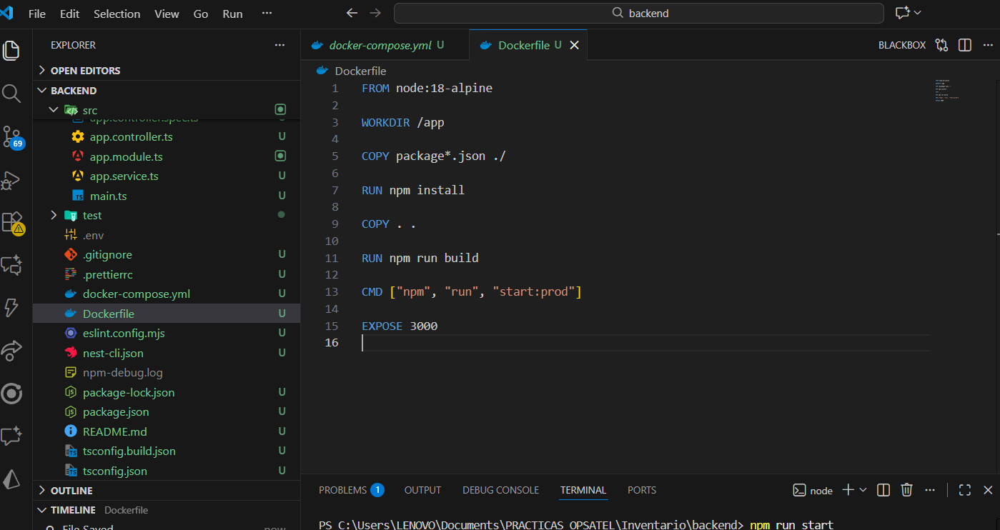
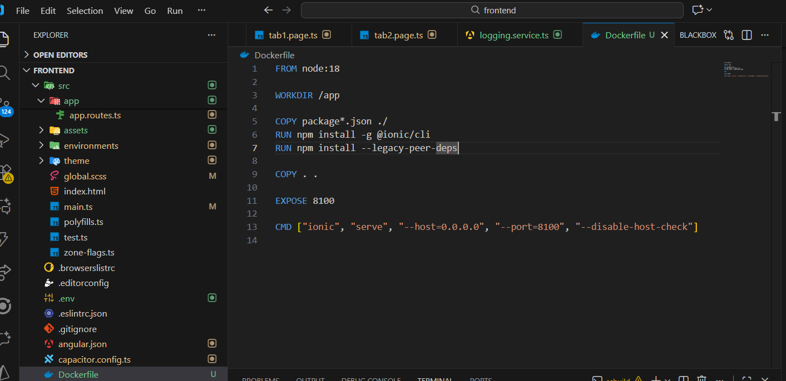
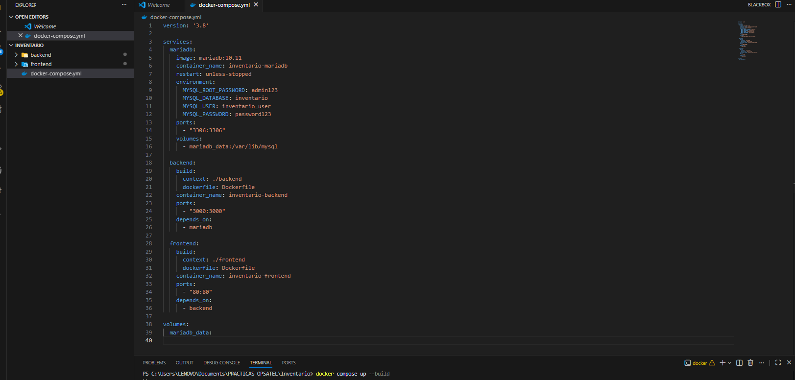
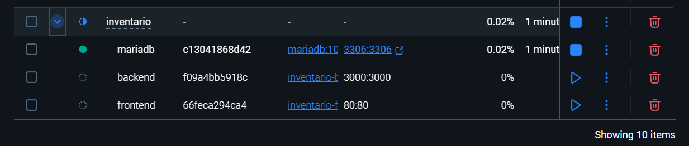

# Práctica Crear imagen personalizada

## 1. Título

Red de contenedores con Backend (NestJS), Frontend (Angular/Ionic) y Base de Datos MariaDB utilizando Docker.

---

## 2. Tiempo de duración

**Tiempo estimado:** 90 minutos

---

## 3. Fundamentos

Docker es una herramienta que permite ejecutar aplicaciones dentro de contenedores ligeros e independientes, garantizando que funcionen de forma consistente en cualquier entorno. En esta práctica se crearán y orquestarán contenedores para tres componentes fundamentales de una aplicación moderna:

- Backend en NestJS, encargado de exponer una API REST.

- Frontend en Angular/Ionic, que consume esa API y muestra los datos.

- Base de datos MariaDB, donde se almacenará la información consultada por el backend.

Para que estos tres servicios se comuniquen entre sí, se emplea Docker Compose, que permite definir múltiples contenedores en un solo archivo y ejecutarlos como una red integrada. Esto facilita el despliegue, la escalabilidad y el mantenimiento de aplicaciones distribuidas.

## 4. Conocimientos previos

Para realizar esta práctica se requiere:

- Comprender conceptos básicos de Docker: imágenes, contenedores, puertos, volúmenes.

- Conocer NestJS o cualquier framework backend basado en Node.js.

- Conocimiento básico de Angular/Ionic para el desarrollo frontend.

- Conceptos de bases de datos relacionales (MariaDB/MySQL).

- Familiaridad con línea de comandos.

Saber interpretar errores comunes en Docker y solucionar problemas de conectividad entre contenedores.

## 5. Objetivos a alcanzar

- Contenerizar correctamente una API NestJS.

- Contenerizar un frontend Angular/Ionic listo para producción.

- Levantar un servicio de base de datos MariaDB como contenedor.

- Configurar un archivo Docker Compose capaz de conectar todos los servicios.

- Validar la comunicación entre frontend → backend → base de datos.

- Visualizar datos del backend desde el frontend mediante una tabla.

- Crear un ambiente reproducible para proyectos reales usando Docker.

## 6. Equipo necesario

- Laptop o PC con Windows, Linux o macOS.

- Docker Desktop instalado.

- Un editor de código (VS Code recomendado).

- Navegador moderno (Chrome, Firefox, Edge).

- Conexión a Internet para descargar imágenes base (Node, Nginx, MariaDB).

- Espacio disponible en disco para imágenes y contenedores.

## 7. Material de apoyo

- Documentación oficial de Docker: https://docs.docker.com

- NestJS Documentation: https://docs.nestjs.com

- Angular/Ionic Documentation: https://angular.io
 / https://ionicframework.com

- MariaDB Documentation: https://mariadb.com/kb/en/documentation/

- Docker Compose Reference: https://docs.docker.com/compose/

## 8. Procedimiento

### Paso 1: Crear Dockerfile para el Backend NestJS 

Se crea un Dockerfile dentro del backend para empaquetar la aplicación NestJS. Allí se instalan dependencias, se copia el código y se ejecuta npm run build para generar la versión de producción. Esto permite que el backend se ejecute igual en cualquier máquina y exponga el puerto 3000 desde un contenedo



**Figura 8-1. Crear Dockerfile para el Backend NestJS .**

---

### Paso 2: Crear Dockerfile para el Frontend Angular/Ionic

En la carpeta frontend se crea otro Dockerfile con dos etapas: una para construir la app con Node (npm install y npm run build) y otra para servir los archivos generados con Nginx. Si aparecen errores de dependencias (como el conflicto de Capacitor), se ajusta el comando a npm install --legacy-peer-deps.



**Figura 8-2. Crear Dockerfile para el Frontend Angular/Ionic**

---

### Paso 3: Crear archivo Docker Compose principal

En la raíz del proyecto se crea el docker-compose.yml que une los tres servicios: base de datos, backend y frontend. Este archivo hace que todos los contenedores compartan red, se puedan resolver por nombre y arranquen en orden. El frontend debe apuntar a http://backend:3000/api y el backend debe conectarse a mariadb:3306.



**Figura 8-3. Crear archivo Docker Compose principal**

---

### Paso 4: Construir y levantar la red completa

Se ejecuta docker compose up --build desde la raíz. Este comando construye las imágenes y arranca los contenedores. Si falla durante la instalación del frontend, se corrige el Dockerfile usando --legacy-peer-deps o revisando plugins incompatibles.



**Figura 8-3. Construir y levantar la red completa**


### Paso 5: Verificar contenedores activos
Con docker ps se confirma que los contenedores de mariadb, backend y frontend estén activos. Si algún servicio falla, se revisan logs con docker logs <nombre> para identificar errores de instalación, puertos o conexión a la base.

```bash
docker ps
```

### Paso 6: Acceder al Frontend y visualizar los datos

Abrir en navegador:
```bash
http:localhost
```
El frontend carga la tabla de datos obtenidos desde:

```bash
http://backend:3000/api/...
```

### Paso 7: Crear la petición al backend para obtener los productos

Para mostrar datos reales en la tabla del frontend, se añadió en la aplicación React/Ionic un método que realiza una petición HTTP al backend. El frontend llama al endpoint público del backend (GET /products), el cual devuelve todos los registros almacenados en la tabla products de la base de datos.
Este endpoint fue implementado en el controlador NestJS y expone los datos sin filtros para permitir el consumo directo desde el contenedor frontend.

   

## 9. Resultados esperados

Backend, frontend y base de datos operan como servicios independientes usando Docker.

El backend se conecta correctamente a MariaDB dentro de la misma red de contenedores.

El frontend consume la API expuesta por el backend.

Los datos se visualizan en una tabla dinámica.

El proyecto se puede ejecutar completamente con un solo comando:


## 10. Bibliografía

Docker Inc. (2025). Docker Documentation. https://docs.docker.com

NestJS Core Team (2025). NestJS Docs. https://docs.nestjs.com

Angular Team (2025). Angular Documentation. https://angular.io

MariaDB Foundation (2025). MariaDB Reference Manual. https://mariadb.com/kb

Ionic Framework (2025). Ionic Docs. https://ionicframework.com/docs

Merkel, D. (2014). Docker: Lightweight Linux Containers. Linux Journal.